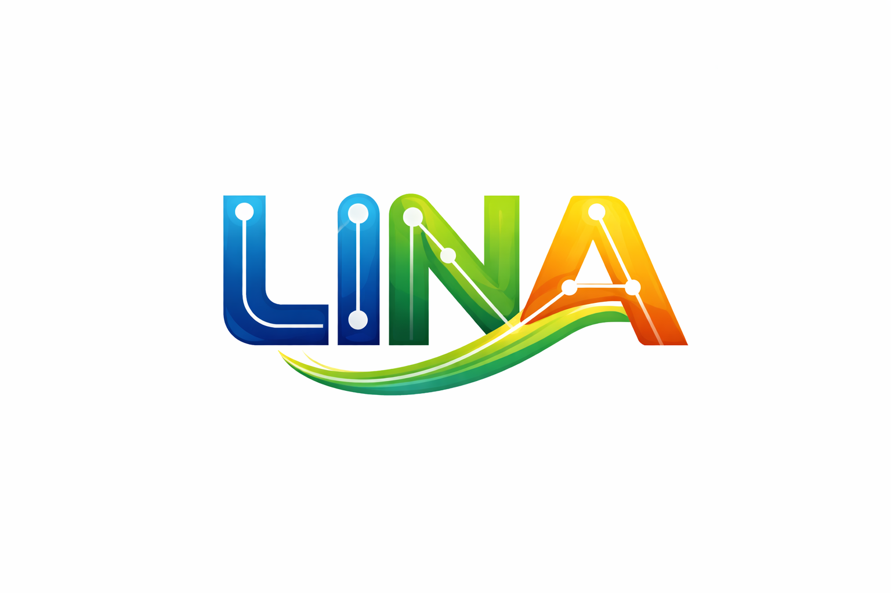

  <!-- Banner -->
  

  <h1>Learning Interconnected Network Analyzer</h1>
  <h2>“Aku bikin LINA (Learning Interconnected Network Analyzer) terinspirasi dari ibuku, Herlina Ningsi. Karena beliau pelindungku di dunia nyata, software ini aku dedikasikan untuk jadi pelindung di dunia digital.” 🤍🛡️</h2>

  

    AI lokal berbasis GUI untuk memahami jaringan di sekitar perangkat secara aman, pasif, dan manusiawi.
  

  <!-- Badges -->
  

    
    
    
  

  <!-- Author -->
  

    Dibuat oleh <a href="https://github.com/BangAguse"><strong>@BangAguse</strong></a>
  

## 🧠 Apa itu LINA?

<b>LINA (Learning Interconnected Network Analyzer)</b> adalah aplikasi desktop berbasis AI lokal yang membantu pengguna memahami apa yang terjadi di jaringan di sekitar perangkat mereka.  
Pengguna cukup menekan tombol <b>START</b>, lalu LINA akan mengamati aktivitas jaringan secara pasif dan menjelaskannya dengan bahasa yang mudah dipahami.

## 🎥 Cara Kerja (Visual)

  
  
<i>User membuka aplikasi dan menekan START</i>

  
  
<i>LINA menganalisis dan menjelaskan data jaringan</i>

## 🔁 Alur Kerja LINA

<ul>
  <li>User membuka aplikasi GUI</li>
  <li>Memilih bahasa (Indonesia / English / العربية)</li>
  <li>Menekan tombol <b>START</b></li>
  <li>LINA mengumpulkan metadata jaringan secara pasif</li>
  <li>Data dinormalisasi & disanitasi</li>
  <li>Data disetor ke AI lokal (GGUF)</li>
  <li>User bertanya, LINA menjawab berdasarkan data</li>
</ul>

## 📊 Visualisasi Konsep

  <!-- Grafik Konsep (SVG sederhana, bisa diganti nanti) -->
  <svg width="600" height="220">
    <rect x="10" y="60" width="150" height="60" fill="#1f2937"/>
    <rect x="220" y="60" width="150" height="60" fill="#2563eb"/>
    <rect x="430" y="60" width="150" height="60" fill="#059669"/>

    <text x="35" y="95" fill="white">Network Data</text>
    <text x="250" y="95" fill="white">LINA AI</text>
    <text x="455" y="95" fill="white">Human Insight</text>

    <line x1="160" y1="90" x2="220" y2="90" stroke="black" />
    <line x1="370" y1="90" x2="430" y2="90" stroke="black" />
  </svg>

  
<i>Dari data mentah → AI lokal → pemahaman manusia</i>

## 🛡️ Prinsip Keamanan & Etika

<ul>
  <li>✅ Read-only & passive observation</li>
  <li>❌ Tidak ada payload inspection</li>
  <li>❌ Tidak ada eksploitasi</li>
  <li>❌ Tidak ada brute force</li>
  <li>❌ Tidak ada cloud / API eksternal</li>
</ul>

## 🧩 Teknologi

<ul>
  <li>Local LLM (GGUF) – <code>mistrallite.Q2_K.gguf</code></li>
  <li>Desktop GUI Application</li>
  <li>Offline-first architecture</li>
  <li>Multi-language UI (ID / EN / AR RTL)</li>
</ul>

## 📄 Lisensi

Proyek ini dilisensikan di bawah ketentuan yang dijelaskan pada file  
👉 <a href="LICENSE"><b>LICENSE</b></a>

  <b>LINA bukan alat untuk menyerang.</b> 
  LINA adalah alat untuk <b>memahami</b>.

